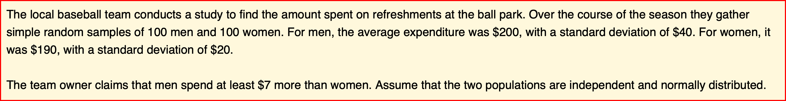

# Package “interpretCI”

Package interpretCI is a package to estimate confidence intervals for mean,
proportion, mean difference for unpaired and paired samples and
proportion difference. Draw estimation plot of the confidence intervals.
Generate documents explaining the statistical result step by step.

# Installation

``` r
#install.packages("devtools")
devtools::install_github("cardiomoon/interpretCI")
```

# Main functions

Package interpretCI have three main functions

### 1. meanCI(), propCI()

The main function is meanCI() and propCI(). The meanCI() function
estimate confidence interval of a mean or mean difference. The propCI()
function estimate confidence interval of a proportion or difference in
proportion. Both functions can take raw data or summary statistics.

``` r
# With raw data
meanCI(mtcars,mpg)
```


    call: meanCI.data.frame(x = mtcars, mpg) 
    method: One sample t-test 
    alternative hypothesis:
       true mean  is not equal to  0 

    Results
    # A tibble: 1 × 7
      m        se     DF    lower    upper    t      p        
      <chr>    <chr>  <chr> <chr>    <chr>    <chr>  <chr>    
    1 20.09062 1.0654 31    17.91768 22.26357 18.857 < 2.2e-16

``` r
# With raw data, Perform one-sample t-test  
meanCI(mtcars,mpg,mu=23)
```


    call: meanCI.data.frame(x = mtcars, mpg, mu = 23) 
    method: One sample t-test 
    alternative hypothesis:
       true mean  is not equal to  23 

    Results
    # A tibble: 1 × 7
      m        se     DF    lower    upper    t       p      
      <chr>    <chr>  <chr> <chr>    <chr>    <chr>   <chr>  
    1 20.09062 1.0654 31    17.91768 22.26357 -2.7307 0.01033

The meanCI function estimate confidence interval of mean without raw
data. For example, you can answer the following question.


``` r
meanCI(n=150,m=115,s=10,alpha=0.01)
```


    call: meanCI.default(n = 150, m = 115, s = 10, alpha = 0.01) 
    method: One sample t-test 
    alternative hypothesis:
       true mean  is not equal to  0 

    Results
    # A tibble: 1 × 7
      m     se     DF    lower    upper    t      p        
      <chr> <chr>  <chr> <chr>    <chr>    <chr>  <chr>    
    1 115   0.8165 149   112.8696 117.1304 140.85 < 2.2e-16

You can specify confidence interval with alpha argument and suggested
true mean with mu argument and select alternative hypothesis with
alternative argument. You can see the full story in the vignette named
“Confidence interval for a mean”.

You can estimate mean difference with or without raw data.

``` r
meanCI(iris,Petal.Width,Petal.Length)
```


    call: meanCI.data.frame(x = iris, Petal.Width, Petal.Length) 
    method: Welch Two Sample t-test 
    alternative hypothesis:
       true unpaired differences in means is not equal to  0 

    Results
    # A tibble: 1 × 6
      control     test         DF     CI                        t       p        
      <chr>       <chr>        <chr>  <chr>                     <chr>   <chr>    
    1 Petal.Width Petal.Length 202.69 -2.56 [95CI -2.87; -2.25] -16.297 < 2.2e-16

You can answer the following question about difference of means.



``` r
x=meanCI(n1=100,n2=100,m1=200,s1=40,m2=190,s2=20,mu=7,alpha=0.05,alternative="greater")
x
```


    call: meanCI.default(n1 = 100, n2 = 100, m1 = 200, s1 = 40, m2 = 190,      s2 = 20, mu = 7, alpha = 0.05, alternative = "greater") 
    method: Welch Two Sample t-test 
    alternative hypothesis:
       true unpaired differences in means is greater than  7 

    Results
    # A tibble: 1 × 6
      control test  DF     CI                     t       p     
      <chr>   <chr> <chr>  <chr>                  <chr>   <chr> 
    1 x       y     145.59 10.00 [95CI 2.60; Inf] 0.67082 0.2517

You can see the full story in the vignette named “Hypothesis test for a
difference between means”.

Similarly, propCI() function can estimate confidence interval of
proportion or difference in two proportions.

``` r
propCI(n=100,p=0.73,P=0.8,alpha=0.01)
```

    $data
    # A tibble: 1 × 1
      value
      <lgl>
    1 NA   

    $result
      alpha   n df    p   P   se critical        ME     lower     upper
    1  0.01 100 99 0.73 0.8 0.04 2.575829 0.1030332 0.6269668 0.8330332
                          CI     z     pvalue alternative
    1 0.73 [99CI 0.63; 0.83] -1.75 0.08011831   two.sided

    $call
    propCI(n = 100, p = 0.73, P = 0.8, alpha = 0.01)

    attr(,"measure")
    [1] "prop"

### 2. plot()

The plot() function draw a estimation plot with the result of meanCI()
function. You can see many examples on the following sections.

### 3.interpret()

You can generate documents explaining the statistical result step by
step. You can see several vignettes in this package and they are made by
interpret() function. For example, you can answer the following
question.


``` r
x=propCI(n1=150,n2=100,p1=0.71,p2=0.63,P=0,alternative="greater")
x
```

    $data
    # A tibble: 1 × 2
      x     y    
      <lgl> <lgl>
    1 NA    NA   

    $result
      alpha   p1   p2  n1  n2  DF   pd         se critical        ME      lower
    1  0.05 0.71 0.63 150 100 248 0.08 0.06085776 1.644854 0.1001021 -0.0201021
          upper                      CI ppooled   sepooled        z     pvalue
    1 0.1801021 0.08 [95CI -0.02; 0.18]   0.678 0.06032081 1.326242 0.09237975
      alternative
    1     greater

    $call
    propCI(n1 = 150, n2 = 100, p1 = 0.71, p2 = 0.63, P = 0, alternative = "greater")

    attr(,"measure")
    [1] "propdiff"

The interpret() function generate the document explaining statistical
result step-by-step automatically and show this on RStudio viewer or
default browser. It is the same document as the vignette named
“Hypothesis test for a proportion”.

``` r
interpret(x)
```

# Basic Usage

### 1. Confidence interval of mean

The meanCI function estimate confidence interval of mean. The First
example estimate the confidence interval of mean.

``` r
meanCI(mtcars,mpg)
```


    call: meanCI.data.frame(x = mtcars, mpg) 
    method: One sample t-test 
    alternative hypothesis:
       true mean  is not equal to  0 

    Results
    # A tibble: 1 × 7
      m        se     DF    lower    upper    t      p        
      <chr>    <chr>  <chr> <chr>    <chr>    <chr>  <chr>    
    1 20.09062 1.0654 31    17.91768 22.26357 18.857 < 2.2e-16

You can plot the confidence interval of mean.

``` r
meanCI(mtcars,mpg) %>% plot()
```

 You can
see all data plotted. The mean and its 95% confidence interval (95% CI)
is displayed as a point estimate and vertical bar respectively on a
separate but aligned axes.

### 2. Mean difference in unpaired samples

The meanCI function can estimate confidence interval of mean difference.
This example estimate the confidence interval of mean difference between
unpaired sample.

``` r
x=meanCI(iris,Sepal.Width,Sepal.Length)
x
```


    call: meanCI.data.frame(x = iris, Sepal.Width, Sepal.Length) 
    method: Welch Two Sample t-test 
    alternative hypothesis:
       true unpaired differences in means is not equal to  0 

    Results
    # A tibble: 1 × 6
      control     test         DF     CI                        t       p        
      <chr>       <chr>        <chr>  <chr>                     <chr>   <chr>    
    1 Sepal.Width Sepal.Length 225.68 -2.79 [95CI -2.94; -2.64] -36.463 < 2.2e-16

Above result is consistent with t.test()

``` r
t.test(iris$Sepal.Width, iris$Sepal.Length)
```


        Welch Two Sample t-test

    data:  iris$Sepal.Width and iris$Sepal.Length
    t = -36.463, df = 225.68, p-value < 2.2e-16
    alternative hypothesis: true difference in means is not equal to 0
    95 percent confidence interval:
     -2.93656 -2.63544
    sample estimates:
    mean of x mean of y 
     3.057333  5.843333 

You can get estimation plot with plot().

``` r
plot(x,ref="test",side=FALSE)
```


An estimation plot has two features.

1.  It **presents all datapoints** as a swarmplot, which orders each
    point to display the underlying distribution.

2.  It presents the effect size as a 95% confidence interval on a
    separate but aligned axes.

### 3. Mean differences in paired sample

You can draw an estimation plot in paired sample.

``` r
data(Anorexia,package="PairedData")
meanCI(Anorexia,Post,Prior,paired=TRUE) %>% plot(ref="test",side=FALSE)
```


Above result is compatible with t.test().

``` r
t.test(Anorexia$Post,Anorexia$Prior,paired=TRUE)
```


        Paired t-test

    data:  Anorexia$Post and Anorexia$Prior
    t = 4.1849, df = 16, p-value = 0.0007003
    alternative hypothesis: true difference in means is not equal to 0
    95 percent confidence interval:
      3.58470 10.94471
    sample estimates:
    mean of the differences 
                   7.264706 

### 4. One-sided test

Anorexia data in PairedData package consist of 17 paired data
corresponding to the weights of girls before and after treatment for
anorexia. Test the claims that the patients gain at least more than four
pounds in weights after treatment. Use an 0.05 level of significance.
Assume that the mean differences are approximately normally distributed.

``` r
t.test(Anorexia$Post,Anorexia$Prior,paired=TRUE,alternative="greater",mu=4)
```


        Paired t-test

    data:  Anorexia$Post and Anorexia$Prior
    t = 1.8807, df = 16, p-value = 0.03917
    alternative hypothesis: true difference in means is greater than 4
    95 percent confidence interval:
     4.233975      Inf
    sample estimates:
    mean of the differences 
                   7.264706 

You can see the 95% confidence interval of paired mean difference is
4.23 to Inf. And the p value is 0.03917. The plot.meanCI() function
visualize the confidence interval. Note the line of true mean(mu) does
not cross the confidence interval.

``` r
x=meanCI(Anorexia$Post,Anorexia$Prior,paired=TRUE,alternative="greater",mu=4)
plot(x,ref="test",side=FALSE)
```


You can get document explaining the statistical result step by step with
the following R code.

``` r
interpret(x)
```

The interpret() function generate the document automatically and show
this on RStudio viewer. It is the same document as the vignette named
“Hypothesis test for the difference between paired means”.
Alternatively, you can see the document with default browser.

``` r
interpret(x,viewer="browser")
```

### 5. Compare three or more groups

You can set the group variable(x) and test variable(y) to compare
variable among or between groups.

``` r
x=meanCI(iris,Species,Sepal.Length,mu=0) 
x
```


    call: meanCI.data.frame(x = iris, Species, Sepal.Length, mu = 0) 
    method: Welch Two Sample t-test 
    alternative hypothesis:
       true unpaired differences in means is not equal to  0 

    Results
    # A tibble: 2 × 6
      control test       DF     CI                        t       p        
      <chr>   <chr>      <chr>  <chr>                     <chr>   <chr>    
    1 setosa  versicolor 86.538 -0.93 [95CI -1.11; -0.75] -10.521 < 2.2e-16
    2 setosa  virginica  76.516 -1.58 [95CI -1.79; -1.38] -15.386 < 2.2e-16

``` r
plot(x)
```


Alternatively, if you do not specify the variables, meanCI function
select all numeric variables.

``` r
meanCI(iris) %>% plot()
```


You can select variables of interest using dplyr::select.

``` r
iris %>% select(ends_with("Length")) %>% meanCI() %>% plot()
```


### 6. Multiple pairs

You can compare multiple pairs in an estimation plot. Data anscombe2 in
PairedData package consists of 4 sets of paired sample.

``` r
data(anscombe2,package="PairedData")
anscombe2
```

           X1     Y1 X2  Y2     X3     Y3    X4     Y4 Subject
    1   8.885 10.135  8 -35  3.375  6.625 0.540 -0.540     S01
    2  14.380 11.940  7 -30 -0.300  2.300 1.980  0.020     S02
    3   8.015  6.025 17 -25 10.025 11.975 1.100  0.900     S03
    4   5.835  3.045 15 -20  2.350  3.650 3.420  0.580     S04
    5   5.470  1.870 12 -15  7.675  8.325 2.540  1.460     S05
    6  12.060 12.640  5 -10  9.000  9.000 1.655  2.345     S06
    7  11.720  9.660  6  -5  7.325  6.675 4.865  1.135     S07
    8  10.315  9.265 19   0  6.650  5.350 3.980  2.020     S08
    9   5.065  6.155 16   5  4.975  3.025 3.100  2.900     S09
    10  8.235 10.785 11  10  3.300  0.700 2.215  3.785     S10
    11 15.080 12.360 18  15 11.625  8.375 6.305  1.695     S11
    12 13.485 10.175  9  20 17.765  8.235 5.420  2.580     S12
    13 11.300 12.380 14  25 17.090  6.910 4.540  3.460     S13
    14  9.820  9.660 13  30 19.410  8.590 3.655  4.345     S14
    15  9.565  6.955 10  35 20.735  9.265 2.775  5.225     S15

You can draw multiple pairs by setting the **idx** argument with list.

``` r
meanCI(anscombe2,idx=list(c("X1","Y1"),c("X4","Y4"),c("X3","Y3"),c("X2","Y2")),paired=TRUE,mu=0) %>% plot()
```


``` r
x=meanCI(anscombe2,idx=list(c("X1","X2","X3","X4"),c("Y1","Y2","Y3","Y4")),paired=TRUE,mu=0)
plot(x)
```


You can draw multiple pairs with long form data also.

``` r
library(tidyr)
longdf=pivot_longer(anscombe2,cols=X1:Y4)
x=meanCI(longdf,name,value,idx=list(c("X1","X2","X3","X4"),c("Y1","Y2","Y3","Y4")),paired=TRUE,mu=0)
plot(x)
```


### 7. Split the data with group argument

You can split data with group argument and draw estimation plot with
categorical(x) and continuous variable(y).

``` r
meanCI(acs,DM,age,sex) %>% plot()
```


You can select one grouping variable and multiple continuous variables
of interest and compare variables within groups.

``` r
acs %>% select(sex,TC,TG,HDLC) %>% meanCI(group=sex) %>% plot()
```


Alternatively, you can select one grouping variable and multiple
continuous variables of interest and compare each variable between/among
groups.

``` r
acs %>% select(sex,TC,TG,HDLC) %>% meanCI(sex,mu=0) %>% plot()
```


